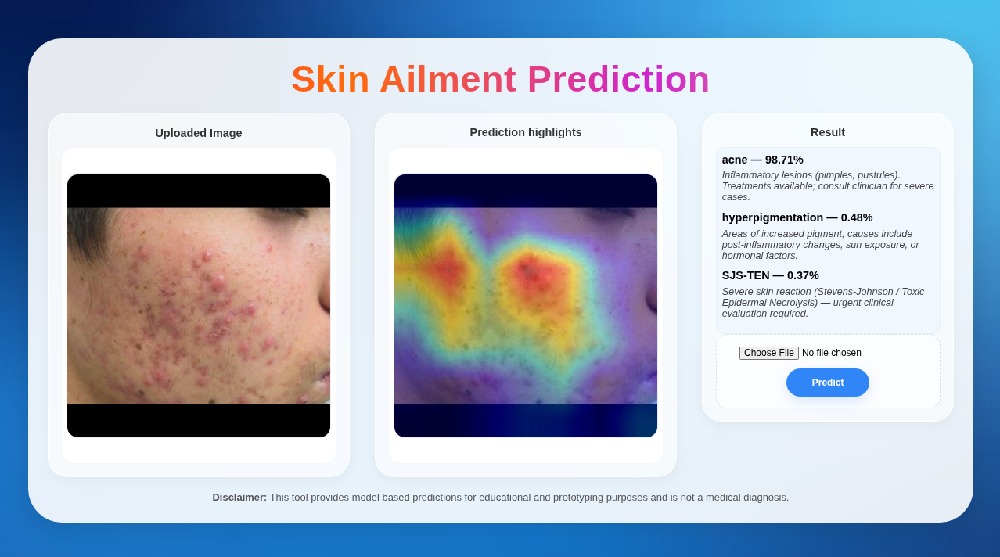

# Skin Ailment Prediction

This project is a web application that utilizes a machine learning model to predict skin ailments from user-uploaded images. The model provides a list of potential conditions with corresponding probabilities, and a visual "Prediction Highlight" to show which part of the image was most influential in the decision.
*   **Dataset:**  [Kaggle](https://www.kaggle.com/datasets/pacificrm/skindiseasedataset/data), [Mendeley](https://data.mendeley.com/datasets/3hckgznc67/1).
*   **Backend:**  Flask.
*   **Frame work & Model:** PyTorch + RestNet50.
*   **Frontend:** HTML, CSS, and JavaScript for the user interface.

## <caption> UI Screenshot
<div align="center">
  
</div>

## Installation and Setup

To get this project up and running on your local machine, follow these steps:

1.  **Clone the repository:**
    ```bash
    git clone https://github.com/EvoLuvDaP/Skin_ailments_prediction.git
    cd Skin_ailments_prediction
    ```

2.  **Run the application:**
    ```bash
    python app.py  # Or your main Python script
    ```

3.  Open your web browser and go to `http://127.0.0.1:5000`.

## ⚠️ Disclaimer

This application is intended for informational and educational purposes only. It is not a substitute for professional medical advice, diagnosis, or treatment. Always consult with a qualified health provider for any questions you may have regarding a medical condition.
